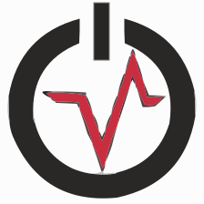
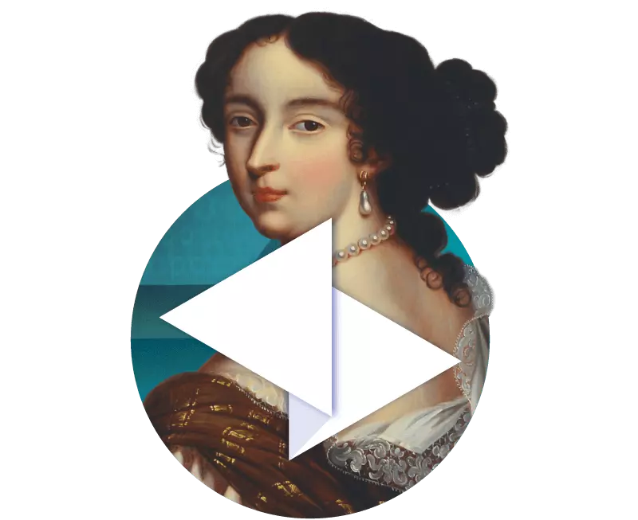

## About me
My name is Trọng Tâm, and I am currently a student at the Academy of Cryptography Techniques. My primary focus is on researching cybersecurity, a field that deeply interests me. In addition to my studies, I actively participate in CTF (Capture The Flag) competitions during my free time, which allows me to further sharpen my skills and stay updated with the latest trends and challenges in the cybersecurity world.

### Skills
#### Language
| Python3 | C++ |
|----------|----------|
|   |   

#### OS

| Kali Linux | Windows |
|----------|----------|
|   |   

### Tools for CTF's
| Wireshark | Volatility | FTK image | AUtopsy |  IDA |
|----------|----------|--------------|---------|-------|
|   |   |   |   |   

## Contact me 

- **Facebook**: [https://www.facebook.com/trongtam21/](https://www.facebook.com/trongtam21/)
- **GitHub**: [https://github.com/trongtam21](https://github.com/trongtam21)
- **Instagram**: [@tr0n9_t4m](https://www.instagram.com/tr0n9_t4m/)
- **Hackmd**: [@tr0n9_t4m](https://hackmd.io/@trongtam21)

